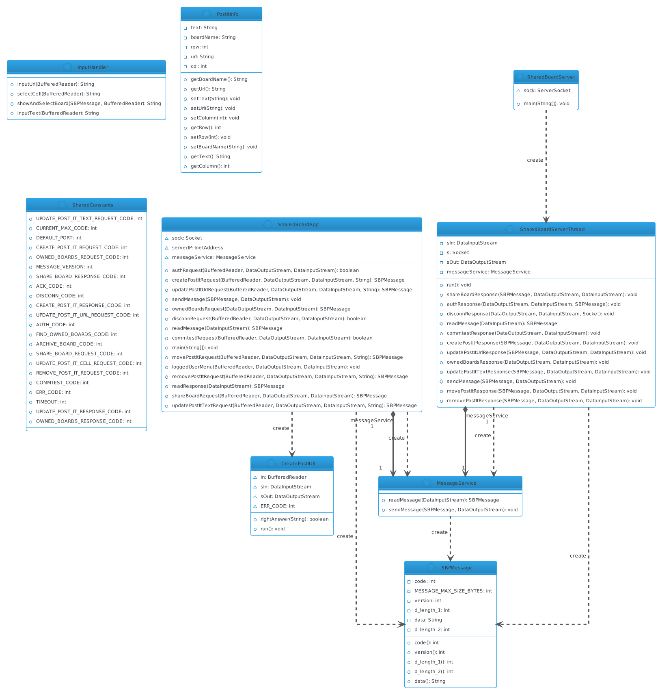

# US3005

## 1. Requirements
As a User, I want to create a post-it on a board.

## 2. Analysis
-A post-it model needs to be implemented
-There should be a separate class for handling the UI for post-it creation
-The UI should use SharedBoardApp (client side) to communicate with the server through a custom protocol
-The client-side application (SharedBoardApp) doesn't have access to stored data - it can only send the new post-it data to the server through a custom protocol and the server thread should then process saving the data. 

## 3. Sequence

### 3.1. Sequence diagram

### 3.2. Running sequence
-When a user chooses a Create Post-it option in the menu, the SharedBoardApp runs the CreatePostIt user interface 
-User inputs data through the interface, and then SharedBoardApp sends a message to the designated server thread through a custom protocol 
-Server thread processes the data and sends a response to the SharedBoardApp. The response is displayed on the console user interface. 

## 4. Class diagram

