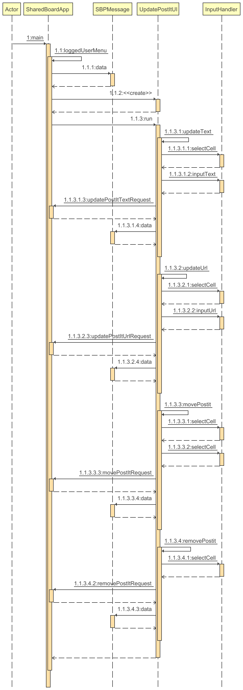
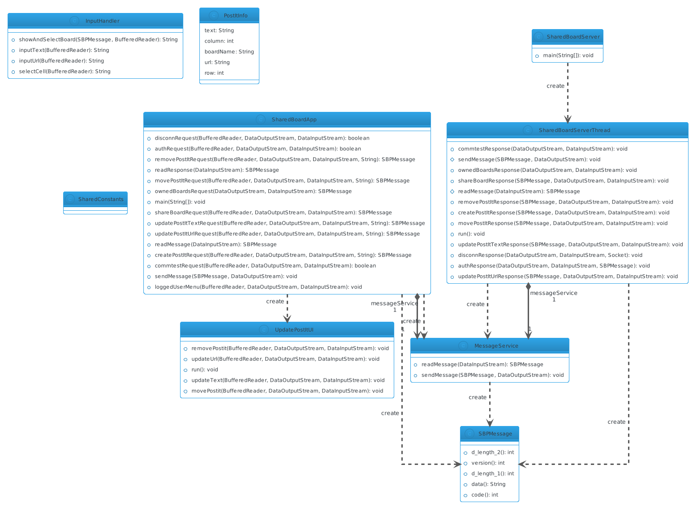

# US3005

## 1. Requirements
As a User, I want to update a post-it on a board.

## 2. Analysis
-A create post-it use case has to be implemented beforehand

-There should be a separate class for handling the UI for post-it update

-The UI should use SharedBoardApp (client side) to communicate with the server through a custom protocol

-The client-side application (SharedBoardApp) doesn't have access to stored data - it can only send the new post-it data to the server through a custom protocol and the server thread should then process saving the data

-Error handling should be implemented (cannot edit post it that doesn't exist, can't add wrong url)

## 3. Sequence

### 3.1. Sequence diagram

### 3.2. Running sequence
-When a user chooses an Update a Post-it option in the menu, the SharedBoardApp runs the UpdatePostIt user interface 
-User chooses what update does he want to make and inputs data through the interface. Then SharedBoardApp sends a message to the designated server thread through a custom protocol 
-Server thread processes the data and sends a response to the SharedBoardApp. The response is displayed on the console user interface. 

## 4. Class diagram

